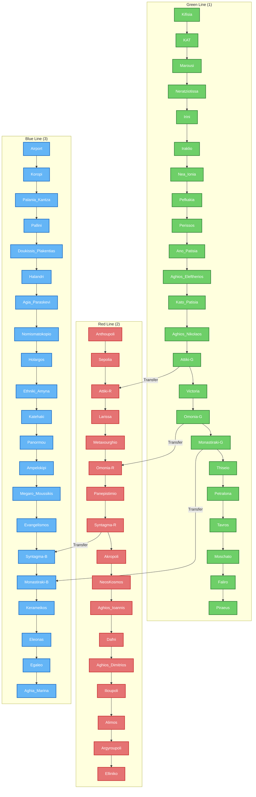

---
aliases:
  - Athenas
---

#is_/same_as :: [[WD~Athens,1524]] 
#is_/different_from :: [ [[../../../../../../America~North/USA/USA~Central/Ohio/counties~Ohio/Athens,Ohio/Athens.county.geojson|Athens.county]], [[../../../../../../America~North/Canada/provinces~Canada/Ontario/counties~Ontario/Leedsand_Grenville/cities~Leedsand_Grenville/Athens,Ontario/Athens.city.geojson|Athens.city]]] 

> **Athens** ( ATH-inz) is the capital and largest city of Greece. 
> A major coastal urban area in the Mediterranean, Athens is also the capital of the Attica region 
> and is the southernmost capital on the European mainland. 
> With its urban area's population numbering over 3.25 million, 
> it is the eighth largest urban area in the European Union. 
> 
> The Municipality of Athens (also City of Athens), 
> which constitutes a small administrative unit of the entire urban area, 
> had a population of 643,452 (2021) within its official limits, and a land area of 38.96 km2 (15.04 sq mi).
>
> Athens is one of the world's oldest cities, with its recorded history spanning over 3,400 years, 
> and its earliest human presence beginning somewhere between the 11th and 7th millennia BC. 
> According to Greek mythology the city was named after Athena, the ancient Greek goddess of wisdom, 
> but modern scholars generally agree that the goddess took her name after the city. 
> 
> Classical Athens was one of the most powerful city-states in ancient Greece. 
> It was a centre for democracy, the arts, education and philosophy, 
> and was highly influential throughout the European continent, particularly in Ancient Rome. 
> For this reason, it is often regarded as the cradle of Western civilization 
> and the birthplace of democracy in its own right independently from the rest of Greece.
>
> In modern times, Athens is a large cosmopolitan metropolis 
> and central to economic, financial, industrial, maritime, political and cultural life in Greece. 
> It is a Beta (+) - status global city according to the Globalization and World Cities Research Network, 
> and is one of the biggest economic centers in Southeastern Europe. 
> It also has a large financial sector, and its port Piraeus is both the 2nd busiest passenger port in Europe, 
> and the 13th largest container port in the world. 
> 
> The Athens metropolitan area or Greater Athens extends beyond its administrative municipal city limits 
> as well as its urban agglomeration, with a population of 3,638,281 (2021) 
> over an area of 2,928.717 km2 (1,131 sq mi).
>
> The heritage of the Classical Era is still evident in the city, represented by ancient monuments,
>  and works of art, the most famous of all being the Parthenon, 
>  considered a key landmark of early Western culture. 
>  
>  The city also retains Roman, Byzantine and a smaller number of Ottoman monuments, 
>  while its historical urban core features elements of continuity through its millennia of history. 
>  
>  Athens is home to two UNESCO World Heritage Sites, the Acropolis of Athens 
>  and the medieval Daphni Monastery. 
>  
>  Athens is also home to several museums and cultural institutions, 
>  such as the [[Athens/National_Archaeological_Museum,Athens]], 
>  featuring the world's largest collection of ancient Greek antiquities, 
>  the [[Acropolis Museum]], the [[Museum of Cycladic Art]], the [[Benaki Museum]], 
>  and the [[Byzantine and Christian Museum]]. 
>  
>  Athens was the host city of the first modern-day Olympic Games in 1896, 
>  and 108 years later it hosted the 2004 Summer Olympics, 
>  making it one of five cities to have hosted the Summer Olympics on multiple occasions.
>
> [Wikipedia](https://en.wikipedia.org/wiki/Athens) 

## Metro System

### Stations 

Modern Athens revolves around 3 central Stations: 
#### Monastiraki-Station  

Most central and nice Place in Athens. 
#### Syntagma-Station 

Close to the Parliament 

#### Omonia-Station 

Run-down attempt for an economic Center. Very much traffic. 

### Lines 

#### Green Line 

The oldest Line, created right after the London Metro. 

#### Blue Line 

The longest Line: from [[Piraeus]] to the [[AIA(Athens_Airport)]] 

## Confidential Links & Embeds: 
- [[../../../../../../../_Standards/geo/Continent/Europe/Europe~South/Greece/Regions-Greek/Attica/cities~Attica/Athens|Athens]] 
- [[../../../../../../../_public/geo/Continent/Europe/Europe~South/Greece/Regions-Greek/Attica/cities~Attica/Athens.public|Athens.public]] 
- [[../../../../../../../_internal/geo/Continent/Europe/Europe~South/Greece/Regions-Greek/Attica/cities~Attica/Athens.internal|Athens.internal]] 
- [[../../../../../../../_protect/geo/Continent/Europe/Europe~South/Greece/Regions-Greek/Attica/cities~Attica/Athens.protect|Athens.protect]] 
- [[../../../../../../../_private/geo/Continent/Europe/Europe~South/Greece/Regions-Greek/Attica/cities~Attica/Athens.private|Athens.private]] 
- [[../../../../../../../_personal/geo/Continent/Europe/Europe~South/Greece/Regions-Greek/Attica/cities~Attica/Athens.personal|Athens.personal]] 
- [[../../../../../../../_secret/geo/Continent/Europe/Europe~South/Greece/Regions-Greek/Attica/cities~Attica/Athens.secret|Athens.secret]] 

