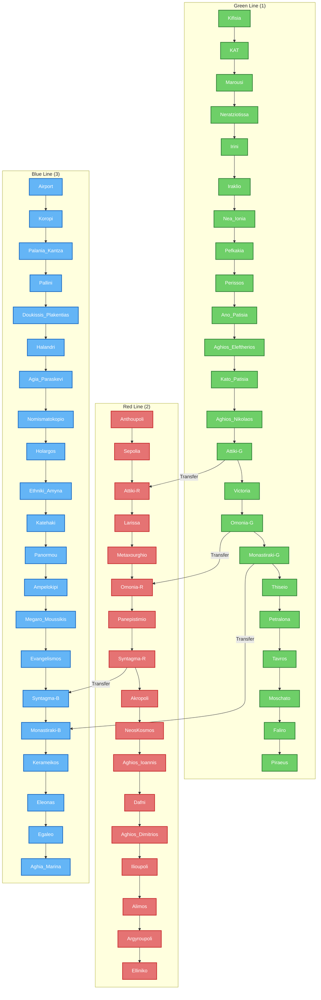

# Athens_Metro

## Stations 

Modern Athens revolves around 3 central Stations: 
#### [[Monastiraki]]-Station  

#### [[Syntagma]]-Station 

#### [[Omonoia_Station]]  

## Lines 

### [[Green_Metro_1,Athens]]

### [[Blue_Metro_3,Athens]] 

### [[Red_Metro_2,Athens]] 

## Metro Network 

